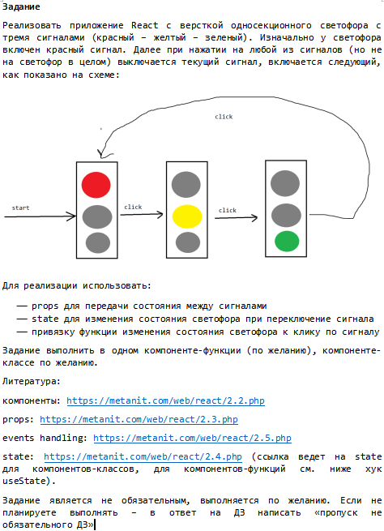
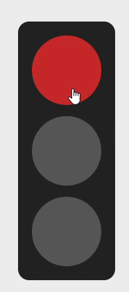

# Traffic Light on React

Все сделано по условию задания. 

 

## Быстрый просмотр кода основных файлов:

### index.js

```javascript
"use client"

import { useState } from "react";
import "./сomponent.css";

export default function TrafficLight() {
  const [activeLight, setActiveLight] = useState("red");

  const getNextLight = (current) => {
    if (current === "red") return "yellow";
    if (current === "yellow") return "green";
    return "red"; 
  };

  const handleSignalClick = () => {
    setActiveLight((prev) => getNextLight(prev));
  };

  const colors = ["red", "yellow", "green"];

  return (
    <div className="trflight">
      {colors.map((color) => {
        const isActive = activeLight === color;
        const className = [
          "trflight__light",
          color,
          isActive && "is-active",
        ]
          .filter(Boolean)
          .join(" ");

        return (
          <button
            key={color}
            type="button"
            className={className}
            aria-pressed={isActive}
            onClick={handleSignalClick}
          />
        );
      })}
    </div>
  );
}

```
### component.css

```css
.trflight {
    display: inline-flex;
    flex-direction: column;
    align-items: center;
    justify-content: center;
    gap: 16px;
    padding: 20px;
    background: #222;
    border-radius: 16px;
    margin: 0 auto;
  }
  
  .trflight__light {
    width: 100px;
    height: 100px;
    border-radius: 50%;
    border: none;
    cursor: pointer;
    background: #555; 
  }
  
  .red { --light-color: #c62828; }
  .yellow { --light-color: #f9a825; }
  .green { --light-color: #2e7d32; }
  
  .is-active {
    background: var(--light-color);
  }
```
### page.js

```javascript
import styles from "./page.module.css";

import TrafficLight from "./сomponent/index";

export default function Home() {
  return (
    <div className={styles.page}>
      <header>
        <h1>React traffic light</h1>
      </header>
      <main className={styles.main}>
        <h2>Traffic light</h2>
        <TrafficLight />
      </main>
      <footer className={styles.footer}>
        <h4>Example created by V.A. Ochenin.</h4>
      </footer>
    </div>
  );
}

```

## Работа приложения:

 

